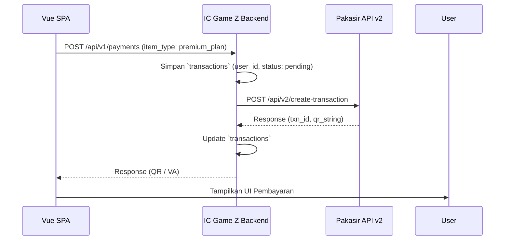
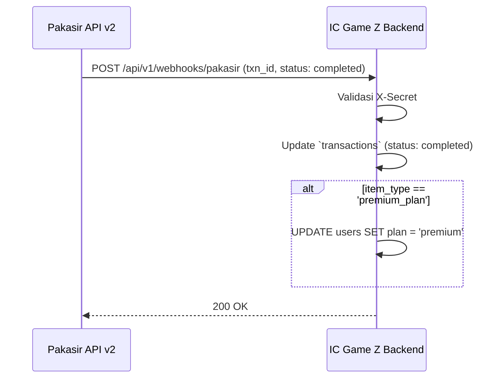
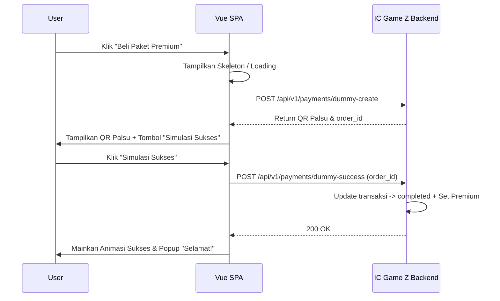

# Alur Kerja (Workflow) - Monolith Payment

## 1. Alur Pembuatan Tagihan (Checkout)
Dalam pendekatan monolith, komunikasi jauh lebih sederhana karena tidak ada perantara.

## 2. Alur Pembayaran Berhasil (Webhook Langsung)
Tidak ada pesan internal antar server. Segera setelah webhook divalidasi, *benefit* langsung diberikan.

## 3. Alur Dummy Testing (Front-End Driven Simulation)
Untuk kebutuhan pengetesan UI/Animasi sebelum Pakasir aktif:

