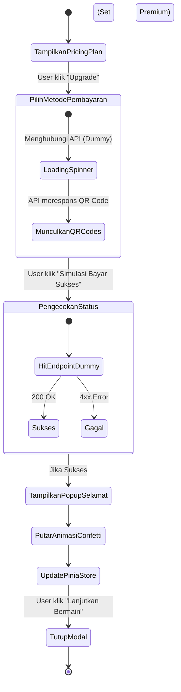

# Alur Kerja (Workflow) - Dummy Frontend Payment UI

## 1. Alur Transisi UI Pembayaran (Gamified Checkout)
Fokus pada alur *user experience* dan animasi yang terjadi di dalam *browser* menggunakan Vue 3.



## 2. Struktur Data Pinia (User Store)
Frontend harus langsung mengimplementasikan perubahan *state* secara *real-time*.

```javascript
// Contoh State Perubahan
const user = ref({
    id: 1,
    name: "Player 1",
    plan: "free", // Sebelum dibayar
    credits: 5
})

// Action setelah "Simulasi Bayar Sukses" diklik dan API return OK
function upgradeToPremium() {
    user.value.plan = "premium";
    user.value.credits = 9999; // Unlimited energi untuk premium
}
```

## 3. Tugas Pengembangan (Dummy Code)
1. Buat komponen `UpgradePlanModal.vue`.
2. Buat komponen `PaymentInstructionModal.vue` (berisi QR palsu dan tombol Simulasi).
3. Buat komponen `SuccessAnimation.vue` (Panggil pustaka `canvas-confetti` dan mainkan SFX jika perlu).
4. Buat fungsi `handleDummyPayment()` yang akan:
   - Hit `POST /api/v1/payments/dummy-success` menggunakan Axios.
   - Ubah boolean `isPaymentSuccess = true` untuk men-trigger CSS animasi.
   - Panggil action Pinia `upgradeToPremium()`.
